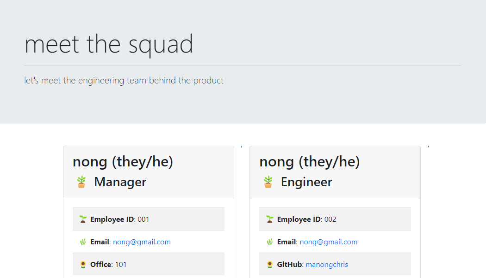
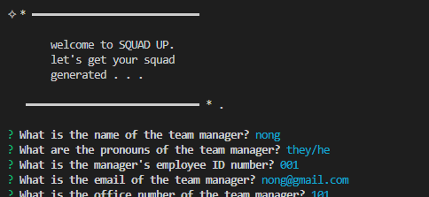

# **squad up**

> This repository utilizes concepts within Object Oriented Programming (OOP) to generate an HTML file of an engineering team based on prompts.

## **Table of Contents**

- [**squad up**](#squad-up)
  - [**Table of Contents**](#table-of-contents)
  - [**Features**](#features)
    - [**Front-End**](#front-end)
  - [**Roadmap**](#roadmap)
  - [**Installation**](#installation)
  - [**Usage Instructions**](#usage-instructions)
  - [Questions](#questions)
  - [Credits](#credits)

## **Features**
The deployed application and repository contains the following features:

### **Front-End**
- Semantic HTML structuring for accessibility.
- Guided comments along JavaScript files to navigate structure.
- Thirty-Party CSS Frameworks including Bootstrap
- Defined objects with functions to obtain data
- Makes use of node package modules such as Inquirer to prompt for data
- Tests to ensure data passed in meets criterion

## **Roadmap**

The application could be improved by integrating the following:

- **Parsing through data**: The data collected and passed into the HTML file will return a comma when multiple objects are passed in.

## **Installation**

Copy the HTTPS or SSH key into your terminal and perform a git pull to create a local copy of the repository. A copy of this repository can be cloned using either of the following codes in the terminal to create a copy in your local environment:

**HTTPS**: 
> `https://github.com/christiangella/squad-up.git`

**SSH**:
> `git@github.com:christiangella/squad-up.git`

## **Usage Instructions**

[Click here](https://watch.screencastify.com/v/eXx6NJgybV5XZoaM8V2H) to watch a live video demonstration as to how to use the application.

Once you have cloned a copy of the repository, navigate to the repository and install the necessary third-party packages using `npm i`. 

Run `npm run test` to ensure that the data can be passed through.

On the command line of the terminal, when in the directory of the repository, run `node index.js`. Afterwards, complete the prompts for as many team members as necessary. When finished, select `No`.

To view your generated HTML file, go to the `dist` folder. The `index.html` file will reflect the page that you just generated.

## Questions

This repository was created by Manong Chris. For further support, reach out by email at christian.gella@gmail.com or by Github at christiangella.

## Credits

This repository was developed for the UC Davis Fullstacks Bootcamp under the UC Davis Continuing and Professional Education.
